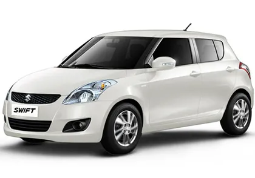

*{
    margin: 0%;
    padding: 0%;
}
body{

}
/* .header{
    background-color: rgba(0, 0, 0, 0.8) !important;
}
.bg-light {
    background-color:rgba(0, 0, 0, 0.8)!important;
} */
.navbar-light .navbar-brand {
    color:white !important;
    font-size: 30px;
    padding-left: 45px;
    font-weight: 700;
}
.titleright{
    color: orange;
    font-size: 40px;
}
.nav-item{
    padding: 10px;
    font-size: 17px;
    font-family: system-ui;
    font-weight: 500;
}
.navbar-light .navbar-nav .active>.nav-link, .navbar-light .navbar-nav .nav-link.active, .navbar-light .navbar-nav .nav-link.show, .navbar-light .navbar-nav .show>.nav-link {
    color: white !important;
}
/* .hitems:hover{
    color: orange !important;
} */
.btn-secondary {
    color: #0ead3e;
    background-color:#21b750 !important ;
    border-color: rgb(29, 155, 54) !important;
    padding: 6px 25px 6px 25px !important;
    margin-right: 150px !important;
    border-width: 2px !important;
}
/* Banner section Start */
#banner{
    background-image: url(OIP1.jpg);
    width: 100%;
    height: 700px;
    background-size: cover;

}
#banner h1 {
    margin: 0;
    font-size: 56px;
    font-weight: 700;
    line-height: 64px;
    color: #f1ecec;
    font-family: system-ui;
    margin-top: 100px;
    line-height: 75px;
}
#banner h2{
    font-size: 29px;
    color: #e5d8d8;
    font-family: italic;
}
.box6{
    margin: 80px;
}
.box{
    margin: 100px;
    border-style: solid;
    border-color: black;
    border-width: 1px;
    margin: 18px;
    height: 150px;
    box-shadow: 2px 2px 10px black;
}
.box h3 {
    font-size: 25px;
    position: relative;
    top: 40px;
    color: black;
    font-family: system-ui;
    font-weight: 700;
}
.iconft{
    font-size: 30px;
    text-align: center;
    position: relative;
    top: 30px;
    color: orange;
}
#about2{
    margin: 20px;
}
.abticon{
    font-size: 30px;
    color: orange;
}
.abt2content{
    padding-left: 30px;
}

#countdown{
    font-size: 35px;
    font-family: cursive;
    letter-spacing: 8px;
    color: orange;
    display: flex;
    justify-content: center;
    background-color: black;
    border-style: solid;
    border-width: 7px;
    border-color: black;

}
.card-title1{
    font-size: 30;
    display: flex;
    justify-content: center;
    font-family: monospace;
    color: orange;
}
.card-text1{
    margin-top: 45px;
    display: flex;
    justify-content: center;
    font-size: 20px;
    text-align: center;
    font-family: cursive;
}
.card-text{
    font-size: 16px;
    font-family: sans-serif;
}
.coun{
    margin-top: 40px;
}
<html>
    <head>
        <title> the CAR</title>
        <link rel="stylesheet" href="./style.css">
        <link href="https://unpkg.com/aos@2.3.1/dist/aos.css" rel="stylesheet">
        
        <meta charset="UTF-8">
        <meta name="viewport" content="width=device-width, initial-scale=1.0">
        <link rel="stylesheet" href="https://cdn.jsdelivr.net/npm/bootstrap@4.0.0/dist/css/bootstrap.min.css" integrity="sha384-Gn5384xqQ1aoWXA+058RXPxPg6fy4IWvTNh0E263XmFcJlSAwiGgFAW/dAiS6JXm" crossorigin="anonymous">
    </head>
    <body>
        <section id="header">
            <nav class="navbar navbar-expand-lg navbar-light bg-dark">
                <a class="navbar-brand" data-aos="flip-left" href="#">RP.</a>
                <button class="navbar-toggler" type="button" data-toggle="collapse" data-target="#navbarSupportedContent" aria-controls="navbarSupportedContent" aria-expanded="false" aria-label="Toggle navigation">
                  .
                </button>
              
                

                  <ul class="navbar-nav m-auto" data-aos="fade-down">
                    <li class="nav-item active">
                      <a class="nav-link" href="#">Home (current)</a>
                    </li>
                    <li class="nav-item active">
                      <a class="nav-link" href="#">About (current)</a>
                    </li>
                    <li class="nav-item active">
                      <a class="nav-link" href="#">Event(current)</a>
                    </li>
                    <li class="nav-item active">
                      <a class="nav-link" href="#">Team (current)</a>
                    </li>
                    <li class="nav-item active">
                      <a class="nav-link" href="#">Contact (current)</a>
                    </li>
                  </ul>
                  

                    <button type="button" class="btn btn-secondary">Get Started</button>
                  

                

              </nav>
        </section>

        <section id="banner">
            

                

                    

                        <h1>Find Your Perfect Car, We Are Welcoming U.</h1>
                        <h2>We can help you find the best car. Check our reviews, compare models and find cars for sale.</h2>
                    

                      
                

                

        </section>
        <section class="coun">
            

x
        </section>

        <section id="about2">
            

                <h2 class="fs-2 fw-bold text-uppercase mb-4 pb-3" style="margin-top: 50px;
                font-size: 55px;
                font-family: cursive;
                color: gray;">Why Choose Us!</h2>
            

            

                

                  

                    

                      <h5 class="card-title1"  data-aos="flip-up">Wide range of brands</h5>
                      
We can help with your financing plan, we can offer some tips and tricks. Drive off with this dream car of yours regardless of your credit history.

                    

                  

                

                

                  

                    

                      <h5 class="card-title1" data-aos="flip-up">Trusted by our clients</h5>
                      
We can help with your financing plan, we can offer some tips and tricks. Drive off with this dream car of yours regardless of your credit history.

                    

                  

                

                

                  

                    

                      <h5 class="card-title1" data-aos="flip-up">Fast & easy financing</h5>
                      
We can help with your financing plan, we can offer some tips and tricks. Drive off with this dream car of yours regardless of your credit history.

                    

                  

                

              

          </section>

        <section style="margin-top: 90px;">
            

                <h2 class="fs-2 fw-bold text-uppercase mb-4 pb-3" style="
                font-size: 55px;
                font-family: cursive;
                color: gray;">Our Poducts!</h2>
            

            

                

                  
                  

                    <h5 class="card-title">Swift 8-series Yellow model</h5>
                    <h5 class="card-title">$ 10,00,000...</h5>
                    
This is a wider card with supporting text below as a natural lead-in to additional content. This content is a little bit longer.

                    
<small class="text-muted">Last updated 3 mins ago</small>

                  

                

                

                  
                  

                    <h5 class="card-title">Swift 8-series black model</h5>
                    <h5 class="card-title">$ 10,00,000...</h5>
                    
This card has supporting text below as a natural lead-in to additional content.

                    
<small class="text-muted">Last updated 3 mins ago</small>

                  

                

                

                  
                  

                    <h5 class="card-title">Swift 8-series Red model</h5>
                    <h5 class="card-title">$ 10,00,000...</h5>
                    
This is a wider card with supporting text below as a natural lead-in to additional content. This card has even longer content than the first to show that equal height action.

                    
<small class="text-muted">Last updated 3 mins ago</small>

                  

                

              

        </section>

        <section>
            

                

                  
                  

                    <h5 class="card-title">Swift 8-series White model</h5>
                    <h5 class="card-title">$ 10,00,000...</h5>
                    
This is a wider card with supporting text below as a natural lead-in to additional content. This content is a little bit longer.

                    
<small class="text-muted">Last updated 3 mins ago</small>

                  

                

                

                  
                  

                    <h5 class="card-title">Swift 8-series Blue model</h5>
                    <h5 class="card-title">$ 10,00,000...</h5>
                    
This card has supporting text below as a natural lead-in to additional content.

                    
<small class="text-muted">Last updated 3 mins ago</small>

                  

                

                

                  
                  

                    <h5 class="card-title">Swift 8-series Gray model</h5>
                    <h5 class="card-title">$ 10,00,000...</h5>
                    
This is a wider card with supporting text below as a natural lead-in to additional content. This card has even longer content than the first to show that equal height action.

                    
<small class="text-muted">Last updated 3 mins ago</small>

                  

                

              

        </section>

        

            <h2 class="fs-2 fw-bold text-uppercase mb-4 pb-3" style="
            font-size: 55px;
            font-family: cursive;
            margin-top: 50px;
            color: gray;">Contact</h2>
        

        <section style="
        background: rgb(212, 138, 232);
        ">

            <section id="contact" class="contact">
                

          
                  

          
                    

          
                        

                          <i class="bi bi-geo-alt flex-shrink-0"></i>
                          

                            <h4>Location:</h4>
                            
19-1/D, APHB Conlony, Hyderabad, Telangana 500064

                          

                        

          
                        

                          <i class="bi bi-envelope flex-shrink-0"></i>
                          

                            <h4>Email:</h4>
                            
shift@example.com

                          

                        

          
                        

                          <i class="bi bi-phone flex-shrink-0"></i>
                          

                            <h4>Call:</h4>
                            
+1 4498 48855 66

                          

                        

          
                        

                          <i class="bi bi-clock flex-shrink-0"></i>
                          

                            <h4>Open Hours:</h4>
                            
Mon-Sat: 11AM - 10PM

                          

                        

          
                    

          
                    

                      <form action="forms/contact.php" method="post" role="form" class="php-email-form">
                        

                          

                            <input type="text" name="name" class="form-control" id="name" placeholder="Your Name" required>
                          

                          

                            <input type="email" class="form-control" name="email" id="email" placeholder="Your Email" required>
                          

                        

                        

                          <input type="text" class="form-control" name="subject" id="subject" placeholder="Subject" required>
                        

                        

                          <textarea class="form-control" name="message" rows="7" placeholder="Message" required></textarea>
                        

                        

                          
Loading

                          

                          
Your message has been sent. Thank you!

                        

                        
<button type="submit">Send Message</button>

                      </form>
                    
<!-- End Contact Form -->
          
                  

          
                

              </section><!-- End Contact Section -->
        </section>
        
        
        
        </body>
        
        

</html>